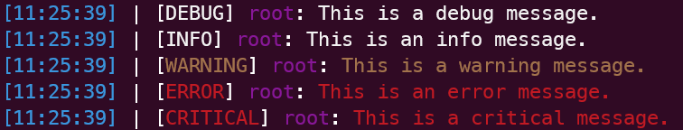

# ChromaLogger

A simple colored wrapper for the Python logging library that includes the time, level, logger name (default `root`), and message.



## Installation

```bash
git clone https://github.com/NCSickels/ChromaLogger.git
cd ChromaLogger

# Install the required packages - colorama, termcolor
pip install requirements.txt
```

## Usage

```python
from ChromaLogger import ChromaLogger

logger = ChromaLogger()
logger.get_logger()

logger.debug("Debug message")
logger.info("Info message")
logger.warning("Warning message")
logger.error("Error message")
logger.critical("Critical message")
```
